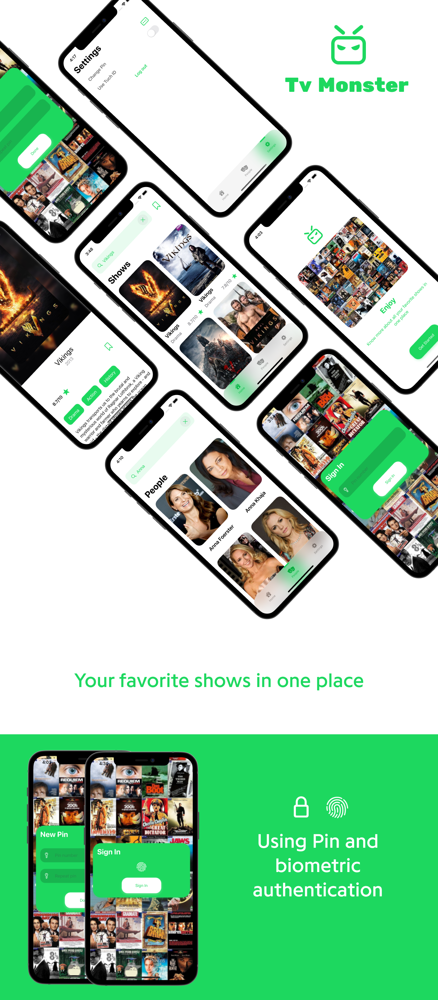
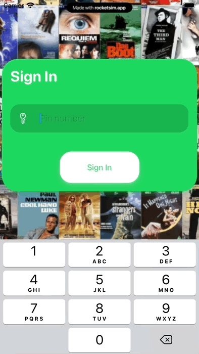

# TvMonster

<p>&nbsp;</p>



<p>&nbsp;</p>

# Description


This is an iOS app created as a Take Home Project for Jobsity. This app shows listing TV series, using the API provided by the TVMaze website. The solution is using SwiftUI 3 following MVVM and container/presentation patterns. Also, using the latest structured concurrency. Core Data was picked as local persistence.

<p>&nbsp;</p>

General Considerations:
- While searching i am using return tap to perform search.
- Demo tested on virtual simulator.
- Distribuition package exported inside dist folder.
- I will appreciate some feedback. Please contact me:
- obed1355@gmail.com

<p>&nbsp;</p>

Considerations for a next iteration of the project:
- Dark theme is suitable.
- Better Images to improve design and better performance.
- Uni test api layer.

<p>&nbsp;</p>

# Features

### All features provided by Jobsity have been implemented in this solution, including bonus features.

<p>&nbsp;</p>

**Main Features:**

- List all of the series contained in the API used by the paging scheme provided by the
API.
- Allow users to search series by name.
- The listing and search views must show at least the name and poster image of the
series.

After clicking on a series, the application should show the details of the series, showing
the following information:

- Name
- Poster
- Days and time during which the series airs
- Genres
- Summary
- List of episodes separated by season

After clicking on an episode, the application should show the episode’s information,
including:

- Name
- Number
- Season
- Summary
- Image, if there is one

<p>&nbsp;</p>

**Bonus Features:**

- Allow the user to set a PIN number to secure the application and prevent unauthorized
users.
- For supported phones, the user must be able to choose if they want to enable fingerprint
authentication to avoid typing the PIN number while opening the app.
- Allow the user to save a series as a favorite.
- Allow the user to delete a series from the favorites list.
- Allow the user to browse their favorite series in alphabetical order, and click on one to. This fnctionality works when toggling a button next to the async search bar in Home section.
see its details.
- Create a people search by listing the name and image of the person.

After clicking on a person, the application should show the details of that person, such
as:

- Name
- Image
- Series they have participated in, with a link to the series details.

<p>&nbsp;</p>

**Extra Features:**

- Added minimal onboarding screen.
- I had a little time to create some unit tests.

<p>&nbsp;</p>

# Tools


- XCode 13.1
- iOS 15
- SwiftUI 3
- Swift
- Core Data
- Postman
- Figma

<p>&nbsp;</p>

# Third Party Packages

### Using Swift Package Manager

<p>&nbsp;</p>

### KingFisher

- Version 7.2.2
- Used for downloading and caching images from the web.

<p>&nbsp;</p>

# Demo


<p>&nbsp;</p>

## TouchID Demo



<p>&nbsp;</p>

**Note:**
```
The quality and frame motion of this gif might be lower because of the recording software used.
```

<p>&nbsp;</p>

# Design Inspiration


- [https://www.behance.net/gallery/80430137/Filmweb-Movies-TV-Series-app](https://www.behance.net/gallery/80430137/Filmweb-Movies-TV-Series-app)
- [https://www.behance.net/gallery/115715581/Prime-Video-Redesign-project](https://www.behance.net/gallery/115715581/Prime-Video-Redesign-project)
- [https://www.behance.net/gallery/97017777/Netflix-app-UI-REDESIGN-Freebie](https://www.behance.net/gallery/97017777/Netflix-app-UI-REDESIGN-Freebie)

<p>&nbsp;</p>

# Installation

Clone project from the following url:
```
https://github.com/vlari/TvMonster
```

### Ideal Requirements to run the app
- XCode 13
- Swift 5
- Simulator app or device

<p>&nbsp;</p>

## Create by vlari

- [Github](https://github.com/vlari)
- [Linkedin](https://www.linkedin.com/in/ogdev/)
- [Next time you go shopping](https://apps.apple.com/us/app/shopalo/id1598737488)
